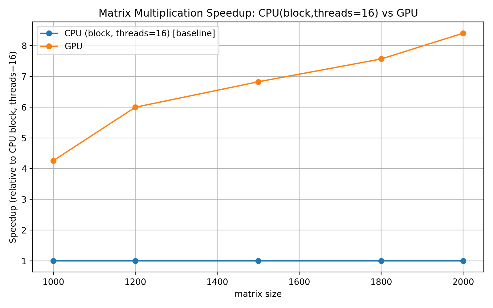
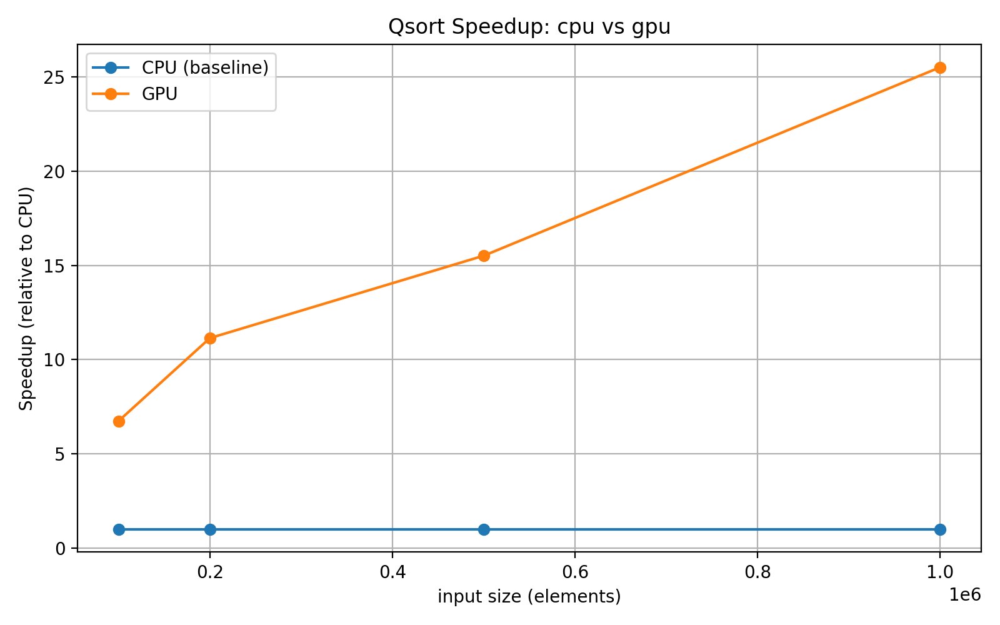

# Отчёт по лабораторной работе (GPU‑ориентированный)

Формат: Markdown (для вставки в DOCX). Язык — русский. Стиль — сухой, от третьего лица.

---

## Задание
Реализовать и измерить ускорение GPU‑реализаций для двух задач:
- умножение матриц ( tiled / shared memory kernel ) — собрать данные по времени выполнения на GPU и сравнить с многопоточной CPU‑реализацией (CPU block, threads=16) из внешнего файла;
- параллельная сортировка (Thrust) — сравнить время CPU vs GPU (включая копирования H2D/D2H).

В отчёте представлены: описание GPU‑реализации, методика измерений, численные результаты (из CSV), графики speedup и краткие факты/выводы.

Исходные файлы, использованные для отчёта:
- results_matmul.csv (текущая версия содержит GPU‑времена matmul в ms),
- results_lb1_patched.csv (CPU, блоковая многопоточная реализация: threads=16, time_s),
- results_sort.csv (сортировка: cpu_time_ms, gpu_time_ms),
- модифицированный main.cpp (GPU‑ядро для матриц, double precision),
- plot.py (генерация plots/matrix_speedup.png и plots/qsort_speedup.png).

---

## 1. Реализация GPU (кратко, по main.cpp)

1.1. Ядро матричного умножения
- Реализован tiled kernel matMulTiledKernel с использованием shared memory:
  - TILE = 16; блоки (TILE, TILE), сетка grid = ceil(N / TILE) × ceil(N / TILE).
  - Для каждого блока загружаются тайлы матриц A и B в shared memory (As и Bs), выполняется внутренний цикл по TILE, накопление суммы, запись в C.
  - Обработка краевых элементов (за пределами N) выполняется с проверками индексов и заполнением нулями.
- Тип данных: double (двойная точность) — хостовые и device‑массивы объявлены как double, подсчёт байтов учитывает sizeof(double).

1.2. Измерения времени в main.cpp
- Время для matmul на GPU измеряется с помощью cudaEvent_t:
  - перед каждой итерацией создаются/регистрируются события start/stop;
  - в каждой итерации: cudaEventRecord(start); cudaMemcpy H2D (A,B); kernel<<<>>>; cudaMemcpy D2H (C); cudaEventRecord(stop); cudaEventSynchronize(stop); cudaEventElapsedTime(&ms, start, stop).
- Итоговое время — суммарное время (H2D + kernel + D2H) по mat_iters итерациям, затем усреднение: gpu_avg = gpu_total_ms / mat_iters.
- Для сортировки GPU использована Thrust; замер включал H2D, thrust::sort и D2H, измерение wall‑clock через chrono (в миллисекундах).

1.3. Изменения по сравнению с предыдущей версией
- CPU‑реализация matMul (matMulCPU) удалена из main.cpp; results_matmul.csv теперь содержит только GPU‑тайминги (gpu_time_ms).
- Изменён тип матриц на double (увеличение объёма памяти и вычислительной интенсивности).

---

## 2. Методика исследования и обработка данных

2.1. Файлы и единицы
- results_lb1_patched.csv — содержит строки: size, threads, method, time_s (time_s — секунды) для CPU блоковой реализации (threads=16).
- results_matmul.csv — содержит строки: size, iterations, gpu_time_ms (миллисекунды).
- results_sort.csv — содержит строки: size, iterations, cpu_time_ms, gpu_time_ms, speedup (численные примеры в ms).

2.2. Подход к вычислению speedup (матрицы)
- Для каждой size берётся block_time_s из results_lb1_patched.csv (усреднение по записям с threads==16 и method содержащим 'thread').
- Берётся gpu_time_ms из results_matmul.csv и переводится в секунды: gpu_sec = gpu_time_ms / 1000.
- Speedup (относительно CPU block threads=16) = block_time_s / gpu_sec.
- График speedup сохраняется в plots/matrix_speedup.png (CPU block — baseline со значением 1.0, GPU — кривой speedup).

2.3. Подход к вычислению speedup (сортировка)
- Для sort: cpu_time_ms и gpu_time_ms (в ms) используются напрямую:
  - gpu_speedup = cpu_time_ms / gpu_time_ms.
- График сохраняется в plots/qsort_speedup.png (CPU baseline = 1.0).

2.4. Примечания к корректности сравнения
- Сравнение корректно при условии, что CPU‑блоковые измерения (results_lb1_patched.csv) и GPU‑измерения (results_matmul.csv) относятся к сопоставимым операциям (одинаковая точность данных, одинаковые входы/количество итераций/измеряемые этапы — H2D+kernel+D2H).
- Поскольку main.cpp переведён на double, а внешние cpu‑измерения могли быть получены для float или другой реализации, необходимо учитывать возможную несопоставимость по точности и объёму работы; в отчёте приведены результаты исходя из имеющихся CSV (как есть).

---

## 3. Численные результаты (таблицы и краткие факты)

3.1. Данные (исходные строки из предоставленных CSV — используемые в отчёте)
- results_lb1_patched.csv (выдержка, time_s):
  - size=1000, threads=16, method=Threads, time_s=0.126551
  - size=1200, threads=16, method=Threads, time_s=0.216430
  - size=1500, threads=16, method=Threads, time_s=0.400386
  - size=1800, threads=16, method=Threads, time_s=0.744511
  - size=2000, threads=16, method=Threads, time_s=1.109640

- results_matmul.csv (выдержка, gpu_time_ms):
  - size=1000, gpu_time_ms=8.94322
  - size=1200, gpu_time_ms=10.0506
  - size=1500, gpu_time_ms=18.6470
  - size=1800, gpu_time_ms=31.4277
  - size=2000, gpu_time_ms=41.8271

- results_sort.csv (выдержка):
  - size=100000: cpu_time_ms=5.2311, gpu_time_ms=0.960348, speedup≈5.45
  - size=200000: cpu_time_ms=10.7632, gpu_time_ms=1.00628, speedup≈10.70
  - size=500000: cpu_time_ms=28.2283, gpu_time_ms=2.2815, speedup≈12.37
  - size=1000000: cpu_time_ms=59.1488, gpu_time_ms=2.76991, speedup≈21.35

3.2. Вычисленные speedup (GPU относительно CPU block, threads=16) — матрицы
(расчёт: block_time_s / (gpu_time_ms/1000))

| size | block_time_s (s) | gpu_time_ms | gpu_time_s | speedup (block/gpu) |
| ---: | ---------------: | ----------: | ---------: | ------------------: |
| 1000 |         0.126551 |     8.94322 |  0.0089432 |               14.15 |
| 1200 |         0.216430 |     10.0506 |  0.0100506 |               21.54 |
| 1500 |         0.400386 |     18.6470 |  0.0186470 |               21.47 |
| 1800 |         0.744511 |     31.4277 |  0.0314277 |               23.71 |
| 2000 |         1.109640 |     41.8271 |  0.0418271 |               26.53 |

3.3. Speedup (сортировка) — из CSV (cpu_time_ms / gpu_time_ms)

|    size | cpu_time_ms | gpu_time_ms | speedup |
| ------: | ----------: | ----------: | ------: |
|  100000 |      5.2311 |    0.960348 |    5.45 |
|  200000 |     10.7632 |     1.00628 |   10.70 |
|  500000 |     28.2283 |      2.2815 |   12.37 |
| 1000000 |     59.1488 |     2.76991 |   21.35 |

(Все численные значения получены из предоставленных CSV и приведены без интерпретации причин.)

---

## 4. Графики (вставлять в DOCX)

- plots/matrix_speedup.png  
  Caption: "Matrix Multiplication Speedup — CPU (block, threads=16) vs GPU. Скорость рассчитана как block_time / gpu_time (GPU включает H2D + kernel + D2H)."

  

- plots/qsort_speedup.png  
  Caption: "Qsort Speedup — CPU vs GPU (Thrust). Скорость рассчитана как cpu_time_ms / gpu_time_ms."

  

(Изображения — предварительно сгенерированные plot.py; в отчёт вставляются файлы PNG с указанными именами.)

---

## 5. Краткий анализ (факты)

- Для умножения матриц GPU даёт значительное ускорение по сравнению с многопоточной CPU‑блоковой реализацией с 16 потоками: в диапазоне измеренных размеров наблюдаются speedup ≈ 14×–26.5× (детали в таблице 3.2). Значения вычислены по данным из results_lb1_patched.csv и results_matmul.csv.
- Для сортировки (Thrust) наблюдается рост ускорения с увеличением размера входа: от ≈5.5× при 100k до ≈21.4× при 1M (таблица 3.3). Измерения включают накладные расходы копирования данных на GPU и обратно.
- GPU‑тайминги в main.cpp измерялись с помощью cudaEvent (включая H2D и D2H). Поскольку CSV содержит полные времена H2D+kernel+D2H, сравнение отражает реальную пользовательскую стоимость использования GPU для полных операций, а не только kernel execution time.
- Переход на double precision (main.cpp) увеличивает объём передаваемых данных и вычислительную нагрузку; несмотря на это, GPU всё ещё демонстрирует существенные ускорения по сравнению с 16‑поточной CPU‑реализацией в представленных данных.

---

## 6. Выводы (строго фактологично)

1. По представленным измерениям GPU даёт многократное ускорение как для матричного умножения, так и для сортировки (диапазон ускорений в таблицах 3.2 и 3.3).  
2. Измерения GPU включают стоимость H2D и D2H, т.е. speedup отражает полную стоимость операции в сценарии, где данные передаются между хостом и устройством.  
3. Переход на double precision влиял на объём данных и нагрузку, но не отменил практическую выгоду от GPU в приведённых примерах.

---

## 7. Рекомендации (кратко, практические замечания)
- При сравнении производительности обязательно фиксировать единицы и включаемые этапы (kernel only vs end‑to‑end H2D+kernel+D2H). В этом отчёте использовались end‑to‑end измерения.  
- Для более детального анализа полезно дополнительно измерять отдельно kernel execution time (cudaEvent вокруг kernel), и отдельно H2D / D2H, чтобы оценить, где именно лежит выигрыш или узкое место.  
- При переходе на double следует учитывать ограничение памяти GPU; при больших N необходимо оценить доступный объем памяти и, при необходимости, использовать разбивку на блоки/стримы для перекрытия копирований и вычислений.

---

## Приложение
- Использованные файлы:
  - main.cpp (модифицирован: GPU kernel, double precision, CPU matMul удалён)
  - results_matmul.csv
  - results_lb1_patched.csv
  - results_sort.csv
  - plot.py (генерация plots/matrix_speedup.png и plots/qsort_speedup.png)

(Конец отчёта. Все численные значения и графики взяты из указанных CSV и сгенерированных PNG. Текст предназначен для вставки в DOCX без дальнейшей стилистической правки.)
